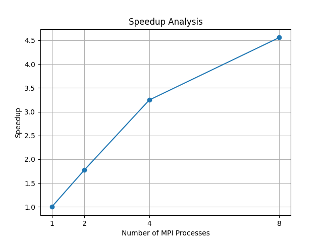
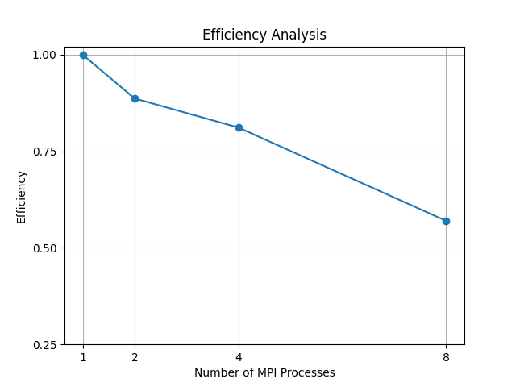

# MPI Decision Tree Classifier


Author: Ahmer Kavas and Nartan Kaplan

## Project Overview

This project implements a parallel decision tree classifier in C using the Message Passing Interface (MPI). The program is designed for execution on Windows with Microsoft MPI. It reads an Iris dataset, distributes the dataset across multiple MPI processes, evaluates candidate decision tree splits in parallel, and reports the resulting training accuracy and execution time.

The implementation focuses on demonstrating how collective MPI communication can be used to parallelize data distribution, split evaluation, class-count aggregation, and final accuracy calculation. The main source file is `src/main.c`, and the executable `dt_mpi.exe` is generated after compilation.

## How It Works

1. Rank 0 reads the dataset
2. Dataset is distributed using MPI_Scatterv
3. Each process computes local statistics
4. MPI_Allreduce aggregates global statistics
5. Best split is selected using Gini impurity
6. Depth-2 tree is constructed
7. Predictions are made locally
8. MPI_Reduce computes total accuracy

## Requirements

- Windows operating system
- Microsoft Visual Studio Build Tools or Visual Studio with the C/C++ compiler
- Microsoft MPI runtime and SDK
- Python 3, only required for regenerating or expanding the dataset

The Microsoft MPI SDK must provide the MPI header files and libraries, typically located under:

- `C:\Program Files (x86)\Microsoft SDKs\MPI\Include`
- `C:\Program Files (x86)\Microsoft SDKs\MPI\Lib\x64`

## Project Structure

```text
MPI_DecisionTree/
+-- dataset/
|   +-- iris.csv
|   +-- iris_large.csv
+-- images/
|   +-- speedup_graph.png
|   +-- efficiency_graph.png
+-- src/
|   +-- main.c
+-- generate_dataset.py
+-- .gitignore
+-- README.md
```

The file `src/main.c` contains the MPI decision tree implementation. The file `generate_dataset.py` expands the original Iris dataset into a larger dataset for performance experiments. The executable `dt_mpi.exe` is produced during compilation and is not stored in the repository.

## Dataset Explanation

The program uses the Iris dataset. Each data row contains four numerical features and one class label:

- sepal length
- sepal width
- petal length
- petal width
- species label

The supported class labels are:

- `Iris-setosa`
- `Iris-versicolor`
- `Iris-virginica`

The original dataset is stored in `dataset/iris.csv`. The expanded dataset is stored in `dataset/iris_large.csv`. The current program reads `dataset/iris_large.csv` by default. This larger file is useful for measuring the effect of parallel execution because the original Iris dataset is too small to provide meaningful timing comparisons.

## Compiling on Windows

Open a Visual Studio Developer Command Prompt or a terminal where `cl.exe` is available. From the project root directory, compile the program with:

```bat
cl /Fe:dt_mpi.exe /I"C:\Program Files (x86)\Microsoft SDKs\MPI\Include" src\main.c /link /LIBPATH:"C:\Program Files (x86)\Microsoft SDKs\MPI\Lib\x64" msmpi.lib
```

This command compiles `src/main.c`, links against the Microsoft MPI library, and produces `dt_mpi.exe` in the project root.

If Microsoft MPI is installed in a different location, update the include and library paths accordingly.

## Running the Program

Run the program from the project root directory so that the relative dataset path can be resolved correctly.

Run with one MPI process:

```bat
mpiexec -n 1 dt_mpi.exe
```

Run with two MPI processes:

```bat
mpiexec -n 2 dt_mpi.exe
```

Run with four MPI processes:

```bat
mpiexec -n 4 dt_mpi.exe
```

Run with eight MPI processes:

```bat
mpiexec -n 8 dt_mpi.exe
```

The program prints dataset information, the selected decision tree rules, training accuracy, and execution time.

## MPI Collective Functions Used

### MPI_Bcast

`MPI_Bcast` is used to broadcast global metadata from rank 0 to all other processes. In this program, rank 0 reads the dataset size and feature count, then broadcasts these values so every process can allocate memory and participate in the computation consistently.

### MPI_Scatterv

`MPI_Scatterv` is used to distribute different-sized portions of the dataset from rank 0 to all MPI processes. This is necessary because the total number of rows may not divide evenly by the number of processes. Each process receives a local subset of rows and performs computations on that subset.

### MPI_Allreduce

`MPI_Allreduce` is used to combine local results from all processes and distribute the global result back to every process. The program uses this collective operation to compute global class counts, feature minima and maxima, node counts, and split statistics required during decision tree construction.

### MPI_Reduce

`MPI_Reduce` is used to aggregate local accuracy counts into a single global count on rank 0. Each process counts the number of correctly classified samples in its local partition, and rank 0 receives the total number of correct predictions.

## Performance Results

| Processes | Time (s) | Speedup | Efficiency |
|-----------|----------|---------|------------|
| 1         | 0.005365 | 1.00    | 1.00       |
| 2         | 0.003025 | 1.77    | 0.89       |
| 4         | 0.001653 | 3.25    | 0.81       |
| 8         | 0.001177 | 4.56    | 0.57       |

## Performance Metrics

The program reports execution time using `MPI_Wtime`. Timing begins after the dataset has been distributed and ends after the accuracy calculation has been reduced to rank 0.

For performance analysis, the following metrics can be calculated:

### Execution Time

Execution time is the wall-clock time required to complete the measured parallel section:

```text
T_p = execution time using p MPI processes
```

### Speedup

Speedup compares the execution time of the serial or single-process run with the execution time of a parallel run:

```text
Speedup = T_1 / T_p
```

where `T_1` is the execution time with one MPI process and `T_p` is the execution time with `p` MPI processes.

### Efficiency

Efficiency measures how effectively the available processes are used:

```text
Efficiency = Speedup / p
```

An efficiency value close to 1 indicates strong process utilization. Lower efficiency may result from communication overhead, load imbalance, synchronization costs, or insufficient dataset size.

## Limitations

- Only a depth-2 tree is implemented
- Limited number of candidate thresholds are evaluated
- Performance depends on dataset size and communication overhead

### Performance Graphs

Speedup graph:



Efficiency graph:



## Dataset Expansion

The file `generate_dataset.py` creates `dataset/iris_large.csv` by repeatedly copying the rows from `dataset/iris.csv`. This increases the number of samples and makes parallel performance measurements more meaningful.

Run the script from the project root directory:

```bat
python generate_dataset.py
```

The script reads:

```text
dataset/iris.csv
```

and writes:

```text
dataset/iris_large.csv
```

The expansion factor can be changed by modifying the `multiplier` variable in `generate_dataset.py`.

## Results Summary

Using the expanded Iris dataset, the depth-2 MPI Decision Tree achieved a training accuracy of approximately 95.31%. The execution time decreased from 0.005365 seconds with 1 process to 0.001177 seconds with 8 processes, demonstrating effective parallel speedup.
